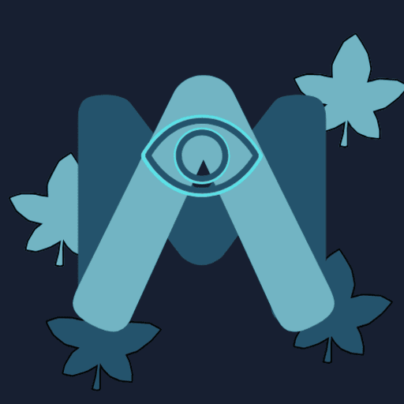

# Manjari : Gamified language learning platform
<table>
<tr>
<td>

</td>
<td>
Manjari is a progressive web app which aims to provide language education to anyone in a gamified way. You might be total beginner to the path of language learning but this platform will help u advance to new heights of communication. Using ai models to keep the questions fresh and interesting , the platform also tracks the users progress to ultimately display the stats in the user page to motivate them to learn every day.
</td>
</tr>
</table>

## Origin
This project was taken up during the Hacknight hackathon and was running within 20hrs .

# Language Learning through Visual Novel

## Overview
Our language learning app combines traditional language learning techniques with an immersive visual novel experience to make learning a new language both fun and effective. Users provide their native language and select their target language, and the app generates a series of interactive activities and story-driven challenges. These activities aim to teach the user essential language skills such as letters, words, sentence construction, and writing — all powered by AI.

## Key Features

### 1. User Input & Language Selection
- **Native Language Input**: The app begins by asking users to input their native language. This helps tailor the learning experience to the user’s starting point.
- **Target Language Selection**: After the native language is specified, users select the language they wish to learn. The app currently supports multiple languages and will continue to expand its offerings.

### 2. Interactive Visual Novel Learning Modules
- **Story Integration**: The app uses a visual novel format where users progress through a story by interacting with characters, choosing dialogue options, and solving language puzzles.
- **Gamified Experience**: Each chapter or scene in the visual novel contains language exercises such as vocabulary building, sentence structure practice, and writing tasks. The storyline and its progression depend on the user’s ability to engage with the language-learning tasks effectively.

### 3. Personalized Language Activities
Based on the target language, users are presented with dynamic exercises that cover various aspects of language learning:
- **Letters & Alphabet**: Learn to recognize, and write letters in the new language.
- **Vocabulary Building**: Expand your vocabulary through interactive activities such as matching words to images, filling in the blanks, and word recall challenges.
- **Sentence Construction**: Practice forming simple to complex sentences. Users engage in exercises where they complete sentences, and learn grammar rules in context.
- **Writing Practice**: The app uses AI to evaluate writing exercises, giving users real-time feedback on spelling, sentence structure, and grammar.

### 4. AI-Powered Language Analysis
- **Real-time Feedback**: AI analyzes user input in writing, providing immediate corrections and suggestions for improvement.
- **Personalized Learning Path**: The app’s AI adapts to the user’s progress, providing customized exercises based on areas of weakness and prior performance.

### 5. Progress Tracking
- **Learning Milestones**: Track your improvement over time, with milestones in vocabulary, and writing accuracy.

### 6. Multimedia Support
- **Visual Aids**: Images, animations, and interactive dialogue choices help users reinforce their language skills in context.

## How It Works

1. **Set Up Your Profile**
   - On first launch, users are asked to enter their native language and choose their target language. The app then customizes the experience accordingly.

2. **Start the Visual Novel**
   - The user is taken into a story-driven adventure, where each decision or task is tied to learning language skills. As they progress, they’ll encounter various characters, situations, and language challenges.

3. **Complete Language Challenges**
   - Each new scene in the visual novel will prompt the user to complete language learning tasks such as writing sentences, or words.

4. **Receive AI Feedback**
   - After completing tasks (e.g., writing or speaking exercises), users receive real-time feedback from the AI, which provides hints and corrections to improve their language skills.

5. **Continuous Learning**
   - The app will adapt to each user's learning pace. If the AI detects that a user is struggling with certain concepts, it will suggest additional practice or simpler exercises to build confidence and competence.

## Technologies Used

Our app is built using a modern tech stack that ensures high performance, scalability, and an engaging user experience. Here's a breakdown of the key technologies used:

### 1. **Node.js**
   - **Purpose**: Node.js is used as the runtime environment for building the backend of the application. It allows us to handle a large number of simultaneous requests with minimal overhead, making the app fast and responsive.
   - **Key Features**: Non-blocking I/O, asynchronous event-driven architecture, and excellent scalability.

### 2. **Express.js**
   - **Purpose**: Express.js is a web framework for Node.js that simplifies API creation, routing, and middleware management. It's lightweight, flexible, and helps us quickly build robust RESTful services.
   - **Key Features**: Easy routing, middleware support, and fast HTTP request handling.

### 3. **Konva.js**
   - **Purpose**: Konva.js is a powerful 2D canvas library used to create interactive and animated visual content in the app. It powers the visual novel scenes, character animations, and language learning activities.
   - **Key Features**: Fast rendering, animations, shape manipulation, and support for interactive graphics.

### 4. **Gemini API**
   - **Purpose**: The Gemini API is used to integrate advanced language learning and natural language processing capabilities into the app. It provides AI-driven features like real-time feedback, grammar checks, and personalized learning paths.
   - **Key Features**: NLP-powered text analysis, personalized language learning insights, and adaptive feedback based on user input.

### 5. **Tailwind CSS**
   - **Purpose**: Tailwind CSS is a utility-first CSS framework used for building custom, responsive, and visually appealing UIs with minimal effort. It helps us create a consistent, modern design across all devices.
   - **Key Features**: Utility-first design, responsive layouts, and rapid prototyping with pre-built components.

### 6. **HTML & JavaScript**
   - **Purpose**: HTML is used to structure the content of the app, while JavaScript powers the dynamic functionality of the app's front-end. JavaScript handles the interactive elements of the visual novel, language exercises, and user feedback loops.
   - **Key Features**: Dynamic interactions, DOM manipulation, and event-driven architecture.

## Benefits

- **Immersive Language Learning**: The visual novel format makes the process of learning a new language engaging, rather than monotonous.
- **Personalized Experience**: Tailored exercises and feedback based on the user’s native language and target language help users learn at their own pace.
- **Real-Time Feedback**: Immediate corrections and suggestions help users understand their mistakes and improve quickly.
- **Fun & Motivating**: Story-driven adventures and gamified learning elements keep users motivated to continue their language-learning journey.

## Getting Started

1. **Access the App**: Open the app in your web browser by visiting the app's URL. You can also add it to your home screen for easy access (on mobile devices).
   
2. **Install the PWA**: Once you're on the app's website, you’ll be prompted to install the app to your device (desktop or mobile). You can choose to install it as a Progressive Web App, which will allow you to use the app offline and get the full experience of a native app.
   - On **mobile**: You’ll see an "Add to Home Screen" prompt in the browser, or you can manually add it from the browser menu.
   - On **desktop**: You can install the PWA from the browser’s install button in the address bar (in supported browsers like Chrome or Edge).

3. **Create an Account**: Sign up for an account using your Google login.

4. **Set Up Your Language Preferences**: Input your native language and select the language you wish to learn. The app will customize your learning path based on your choices.

5. **Start Your Adventure**: Begin exploring the visual novel world and engage with interactive activities that will help you learn your new language. As you progress, you'll unlock new levels and challenges to improve your skills.

## FAQ

### 1. **Which languages can I learn?**
   - The app supports a growing number of languages, including (but not limited to) Spanish, French, German, Chinese, Japanese, and Italian. More languages will be added over time.

### 2. **Do I need an internet connection to use the app?**
   - Yes!

### 3. **Can I switch my target language mid-learning?**
   - Yes! You can change your target language at any time, and the app will adjust your learning path accordingly.

### 4. **How does the AI feedback system work?**
   - Our AI analyzes your answers, offering instant corrections.

## Contributors

<!-- ALL-CONTRIBUTORS-BADGE:START - Do not remove or modify this section -->

<!-- ALL-CONTRIBUTORS-BADGE:END -->

### Contributors
<!-- ALL-CONTRIBUTORS-LIST:START - Do not remove or modify this section -->
<!-- ALL-CONTRIBUTORS-LIST:END -->

## Thank You
